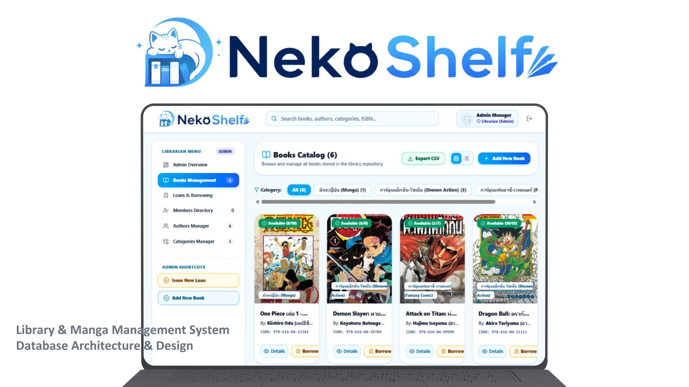
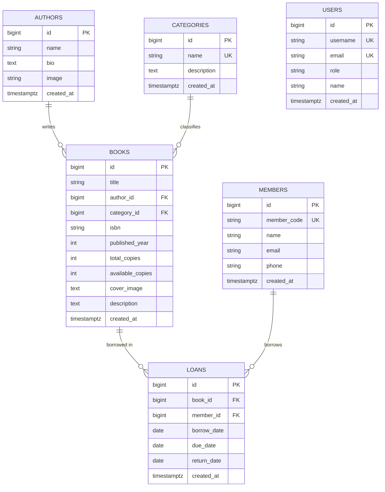

# 🐱 NekoShelf - Library & Manga Management System



> A modern web application for managing libraries, books, and manga collections.

**NekoShelf** is a modern web-based **Library and Manga Management System** built with **React 19**, **Vite**, and **Tailwind CSS v4**. The application uses **Supabase Cloud PostgreSQL** for database management and **Firebase Hosting** for deployment.

The system is designed to support both **Librarians (Admins)** and **Members (Readers)**. Librarians can manage books, members, authors, categories, and borrowing records, while readers can browse, search, and explore the library's collection of books and manga.

---

## 🌐 Live Demo

You can try **NekoShelf** directly in your browser without installing anything:

🚀 **Live Website:** https://nekoshelf.web.app/

---

## 🌟 Key Features

### 📚 Book & Manga Catalog Management

* **Search & Filter:** Quickly search for books by title, author, category, or ISBN.
* **Stock Management:** Track the total number of copies (`total_copies`) and currently available copies (`available_copies`).
* **Book Detail View:** Display book covers, descriptions, publication years, ISBNs, author information, and availability status.

### 🔄 Borrowing & Return Management

* **Issue Loans:** Create new borrowing records with member information, borrowing dates, and due dates.
* **Return Books:** Process returned books and automatically update the number of available copies.
* **Overdue Tracker:** Detect and clearly display overdue borrowing records with visual status indicators.

### 👥 Member Management

* Store member information including member codes, names, email addresses, and phone numbers.
* Track active borrowing records for each member.
* Easily manage and organize library members.

### ✍️ Authors & Categories Management

* **Authors Manager:** Manage authors and illustrators, including biographies and profile images.
* **Categories Manager:** Organize books and manga into categories such as Manga, Shonen Action, Fantasy, and more.

### 📊 Interactive Analytics Dashboard

* **Key Statistics:** Display the total number of books, members, active loans, and overdue records.
* **Popular Books:** Show the most frequently borrowed books.
* **Recent Activities:** Track recent borrowing and return activities.

### 🔐 Role-Based Access

The application supports different user roles:

| Role                  | Description                                                                       |
| --------------------- | --------------------------------------------------------------------------------- |
| **Librarian / Admin** | Full access to manage books, members, authors, categories, and borrowing records. |
| **Reader / Member**   | Browse books, explore categories, and view personal borrowing information.        |

### 📁 CSV Export

Export borrowing and loan records as CSV files for further analysis using Microsoft Excel or Google Sheets.

---

## 🗄️ Database Architecture

NekoShelf uses **Supabase PostgreSQL** with six main relational tables:



### Database Tables

| Table        | Description                                                                          |
| ------------ | ------------------------------------------------------------------------------------ |
| `authors`    | Stores author and illustrator information, including biographies and profile images. |
| `categories` | Stores book and manga categories.                                                    |
| `books`      | Stores book and manga information, including stock and availability.                 |
| `members`    | Stores library member information.                                                   |
| `loans`      | Stores borrowing history and loan status.                                            |
| `users`      | Stores user accounts and role-based access information.                              |

---

## 📜 Database Scripts

The project includes several SQL scripts for database setup and sample data:

* `supabase-schema.sql` – Creates the basic database schema and includes sample data.
* `manga-demo-seed.sql` – Creates tables and sample data for popular manga titles and authors.
* `database-academic-suite.sql` – A simplified SQL script for installation on other systems.
* `update-authors-schema.sql` – Updates the `authors` table by adding an `image` column.

---

## 🛠️ Tech Stack

| Component                       | Technology                         |
| :------------------------------ | :--------------------------------- |
| **Frontend Framework**          | React 19                           |
| **Build Tool & Dev Server**     | Vite 6                             |
| **Styling & UI**                | Tailwind CSS v4                    |
| **Icons**                       | Lucide React                       |
| **Routing**                     | React Router v7                    |
| **Database & Backend Services** | Supabase JS Client with PostgreSQL |
| **Hosting & Deployment**        | Firebase Hosting                   |

---

## 📁 Project Structure

```text
NekoShelf/
├── public/                  # Static assets
│   ├── logo.png             # NekoShelf main logo
│   └── user_logo.png        # Default user avatar
├── src/
│   ├── components/          # UI components
│   │   ├── AuthModal.jsx
│   │   ├── AuthorList.jsx
│   │   ├── BookDetailPage.jsx
│   │   ├── BookList.jsx
│   │   ├── BookModal.jsx
│   │   ├── CategoryList.jsx
│   │   ├── Dashboard.jsx
│   │   ├── DbStatusNotice.jsx
│   │   ├── LoanList.jsx
│   │   ├── MemberList.jsx
│   │   ├── Navbar.jsx
│   │   ├── Sidebar.jsx
│   │   └── UserDashboard.jsx
│   ├── utils/
│   │   └── csvExport.js     # CSV export helper
│   ├── App.jsx              # Main application component
│   ├── main.jsx             # React entry point
│   ├── index.css            # Tailwind directives and custom CSS
│   └── supabaseClient.js    # Supabase client configuration
├── .env                     # Environment variables
├── firebase.json            # Firebase Hosting configuration
├── .firebaserc              # Firebase project configuration
├── package.json             # NPM dependencies and scripts
├── vite.config.js           # Vite configuration
└── README.md                # Project documentation
```

---

## 🚀 Installation & Setup

### 1. Clone the Repository

```bash
git clone https://github.com/HakusaiTH/NekoShelf.git
cd NekoShelf
```

### 2. Install Dependencies

```bash
npm install
```

### 3. Configure Environment Variables

Create a `.env` file in the root directory of the project:

```env
VITE_SUPABASE_URL=https://your-supabase-project-id.supabase.co
VITE_SUPABASE_ANON_KEY=your-supabase-anon-key
```

> **Note:** If Supabase environment variables are not configured, the application can use its mock data system for testing and development.

### 4. Run the Development Server

```bash
npm run dev
```

Then open your browser and navigate to:

```text
http://localhost:5173
```

---

## ☁️ Deployment

NekoShelf is deployed using **Firebase Hosting**.

### Build the Production Version

```bash
npm run build
```

### Deploy to Firebase Hosting

```bash
npx firebase-tools deploy --only hosting
```

---

## 🐙 Git Workflow

Use the following commands to save and push your changes to GitHub:

```bash
# Check the current status
git status

# Add all changes to staging
git add .

# Create a commit
git commit -m "feat: update project"

# Push to the remote repository
git push origin main
```

---

## 📄 Demo Credentials

| Role                  | Email                 | Password | Permissions                                                           |
| :-------------------- | :-------------------- | :------- | :-------------------------------------------------------------------- |
| **Librarian / Admin** | `admin@nekoshelf.com` | `123456` | Full access to manage books, members, loans, and system data          |
| **Reader / Member**   | `user@nekoshelf.com`  | `123456` | Browse books, explore categories, and view personal borrowing records |

---

## 🤝 Contributing

Contributions, suggestions, and improvements are welcome! Feel free to fork this repository, create a new branch, and submit a pull request.

---

## 📄 License

This project is developed for educational and demonstration purposes.

---

## ❤️ About NekoShelf

NekoShelf was created as a modern and user-friendly solution for managing libraries, books, and manga collections. The system combines catalog management, member management, borrowing workflows, analytics, and role-based access into a single web application.

🌐 **Try it now:** https://nekoshelf.web.app/

💻 **GitHub Repository:** https://github.com/HakusaiTH/NekoShelf

---

Developed with ❤️ for the **NekoShelf Project**.
