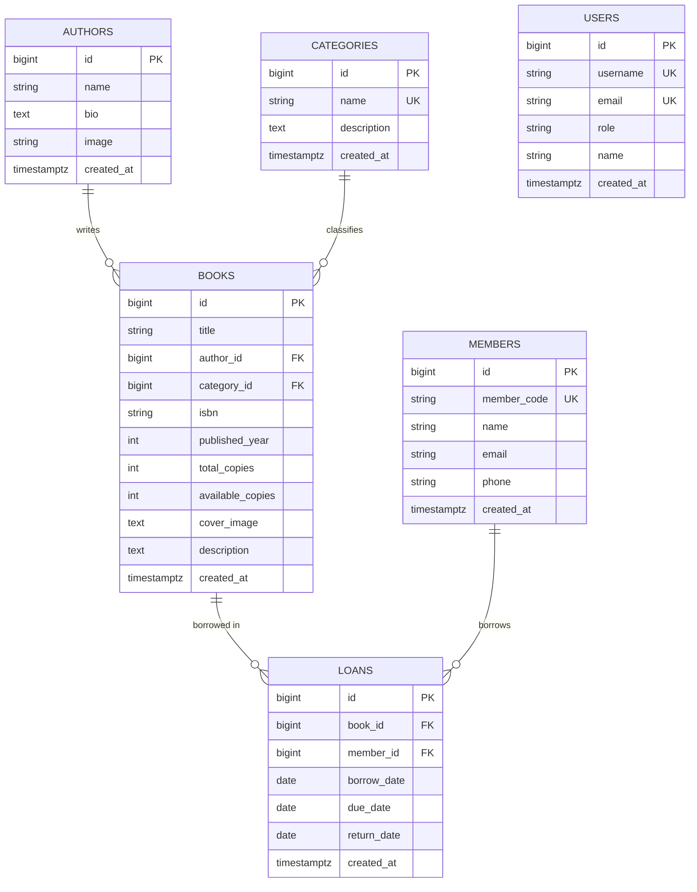

# 🐱 NekoShelf - Library & Manga Management System


**NekoShelf** คือระบบบริหารจัดการห้องสมุดและคลังมังงะ/หนังสือแบบ Modern Web Application ที่พัฒนาด้วย **React 19**, **Vite**, **Tailwind CSS v4** ร่วมกับ **Supabase Cloud PostgreSQL Database** และ **Firebase Hosting**

ระบบถูกออกแบบมาเพื่อรองรับทั้งบทบาท **บรรณารักษ์ (Librarian / Admin)** ในการบริหารจัดการคลังหนังสือ สมาชิก และรายการยืม-คืน รวมถึงบทบาท **สมาชิก/ผู้อ่าน (Member / Reader)** ในการค้นหาและสำรวจคลังมังงะและหนังสือ

---

## 🌟 ฟีเจอร์หลักของระบบ (Key Features)

### 1. 📚 ระบบจัดการคลังหนังสือและมังงะ (Book & Manga Catalog)
- **การค้นหาและกรอง (Search & Filter):** ค้นหาหนังสืออย่างรวดเร็วด้วยชื่อเรื่อง, ชื่อผู้แต่ง (Author), หมวดหมู่ (Category) หรือรหัส ISBN
- **การติดตามจำนวนคงเหลือ (Stock Management):** คำนวณจำนวนเล่มทั้งหมด (`total_copies`) และจำนวนคงเหลือที่พร้อมให้ยืม (`available_copies`) แบบเรียลไทม์
- **หน้ารายละเอียดหนังสือ (Book Detail View):** แสดงภาพปกหนังสือ, เรื่องย่อ, ปีที่พิมพ์, รหัส ISBN, ข้อมูลผู้แต่ง และสถานะพร้อมยืม

### 2. 🔄 ระบบยืม - คืนหนังสือ (Loans & Borrowing Management)
- **การออกรายการยืมใหม่ (Issue Loan):** บันทึกการยืมหนังสือระบุสมาชิก วันที่ยืม และกำหนดวันคืน (`due_date`)
- **การรับคืนหนังสือ (Return Book):** กดรับคืนหนังสือ พร้อมปรับเพิ่มจำนวนหนังสือคงเหลือ (`available_copies`) ในระบบอัตโนมัติ
- **ระบบแจ้งเตือนเกินกำหนด (Overdue Tracker):** ตรวจสอบและแสดงสถานะรายการยืมที่เกินกำหนดคืน (Overdue) ด้วยป้ายสีเตือนชัดเจน

### 3. 👥 ระบบจัดการสมาชิก (Members Directory)
- **ข้อมูลสมาชิก:** จัดเก็บรหัสสมาชิก (`member_code`), ชื่อ-นามสกุล, อีเมล และเบอร์โทรศัพท์
- **ติดตามประวัติการยืม:** ตรวจสอบจำนวนรายการยืมที่กำลังดำเนินการอยู่ของสมาชิกแต่ละคน

### 4. ✍️ ระบบจัดการนักเขียนและหมวดหมู่ (Authors & Categories Manager)
- **Authors Manager:** จัดเก็บรายชื่อนักเขียน/ผู้วาดภาพประกอบ ประวัติสังเขป (Bio) และภาพโปรไฟล์ (เช่น Eiichiro Oda, Koyoharu Gotouge, Hajime Isayama)
- **Categories Manager:** จัดหมวดหมู่หนังสือและมังงะ เช่น มังงะญี่ปุ่น (Manga), การ์ตูนแอ็กชัน (Shonen Action), แฟนตาซี (Fantasy)

### 5. 📊 แดชบอร์ดสรุปผลภาพรวม (Interactive Analytics Dashboard)
- **สถิติสำคัญ:** แสดงยอดรวมหนังสือ สมาชิก รายการยืมที่กำลังดำเนินการ และรายการคืนเกินกำหนด
- **หนังสือยอดนิยม (Popular Books):** แสดงรายการหนังสือที่มีสถิติถูกยืมมากที่สุด
- **กิจกรรมล่าสุด (Recent Activities):** ล็อกการเคลื่อนไหวของการยืม-คืนในระบบ

### 6. 🔐 ระบบกำหนดสิทธิ์การใช้งาน (Role-based Authentication)
- **Librarian (Admin):** สิทธิ์ระดับผู้ดูแล สามารถเพิ่ม/แก้ไข/ลบ ข้อมูลหนังสือ สมาชิก นักเขียน หมวดหมู่ และออกรายการยืม-คืนได้
- **Reader (Member):** สิทธิ์ระดับผู้อ่าน สำหรับการค้นหาหนังสือ ดูหมวดหมู่ และตรวจสอบรายการยืมของตนเอง

### 7. 📁 การส่งออกรายงาน (CSV Export)
- รองรับการ Export ข้อมูลรายการยืม-คืน (Loans List) ออกเป็นไฟล์ CSV เพื่อนำไปใช้วิเคราะห์หรือทำรายงานต่อใน Excel / Google Sheets

---

## 🗄️ โครงสร้างฐานข้อมูล (Database Architecture & Schema)

โปรเจกต์รองรับการเชื่อมต่อกับ **Supabase Cloud PostgreSQL Database** โดยมีโครงสร้างตาราง (Relational Tables) ทั้งหมด 6 ตารางหลัก ดังนี้:



### รายละเอียดตารางในฐานข้อมูล (Tables Specification)

1. **`authors`**: เก็บข้อมูลนักเขียน/นักวาด
   - `id` (BIGINT / SERIAL, Primary Key)
   - `name` (TEXT / VARCHAR) - ชื่อนักเขียน
   - `bio` (TEXT) - ประวัตินักเขียน
   - `image` (TEXT) - URL หรือ Path ของรูปภาพนักเขียน
   - `created_at` (TIMESTAMPTZ)

2. **`categories`**: เก็บหมวดหมู่หนังสือ
   - `id` (BIGINT / SERIAL, Primary Key)
   - `name` (TEXT / VARCHAR, Unique) - ชื่อหมวดหมู่
   - `description` (TEXT) - คำอธิบายหมวดหมู่
   - `created_at` (TIMESTAMPTZ)

3. **`books`**: เก็บข้อมูลหนังสือและมังงะ
   - `id` (BIGINT / SERIAL, Primary Key)
   - `title` (TEXT / VARCHAR) - ชื่อเรื่อง
   - `author_id` (BIGINT, Foreign Key -> `authors.id`)
   - `category_id` (BIGINT, Foreign Key -> `categories.id`)
   - `isbn` (TEXT / VARCHAR) - รหัส ISBN
   - `published_year` (INT) - ปีที่พิมพ์
   - `total_copies` (INT) - จำนวนเล่มทั้งหมด
   - `available_copies` (INT) - จำนวนเล่มที่พร้อมยืม
   - `cover_image` (TEXT) - URL รูปปก
   - `description` (TEXT) - เรื่องย่อ
   - `created_at` (TIMESTAMPTZ)

4. **`members`**: เก็บข้อมูลสมาชิกห้องสมุด
   - `id` (BIGINT / SERIAL, Primary Key)
   - `member_code` (TEXT / VARCHAR, Unique) - รหัสสมาชิก (เช่น MEM001)
   - `name` (TEXT / VARCHAR) - ชื่อสมาชิก
   - `email` (TEXT / VARCHAR) - อีเมล
   - `phone` (TEXT / VARCHAR) - เบอร์โทรศัพท์
   - `created_at` (TIMESTAMPTZ)

5. **`loans`**: เก็บประวัติและสถานะการยืม-คืน
   - `id` (BIGINT / SERIAL, Primary Key)
   - `book_id` (BIGINT, Foreign Key -> `books.id`)
   - `member_id` (BIGINT, Foreign Key -> `members.id`)
   - `borrow_date` (DATE) - วันที่ยืม
   - `due_date` (DATE) - กำหนดส่งคืน
   - `return_date` (DATE, Nullable) - วันที่ส่งคืนจริง (NULL = ยังไม่คืน)
   - `created_at` (TIMESTAMPTZ)

6. **`users`**: เก็บข้อมูลสิทธิ์ผู้ใช้งานในระบบ
   - `id` (BIGINT / SERIAL, Primary Key)
   - `username` (TEXT, Unique)
   - `email` (TEXT, Unique)
   - `role` (TEXT) - 'admin' หรือ 'user'
   - `name` (TEXT)

---

## 📜 รายชื่อ SQL Script ในโปรเจกต์ (Database Scripts)

- [`supabase-schema.sql`](file:///c:/Users/Fujiwara/code/nekoshelf/supabase-schema.sql): สคริปต์สร้างตารางพื้นฐาน พร้อมปิดใช้งาน RLS และ Seed Data วรรณกรรมคลาสสิก
- [`manga-demo-seed.sql`](file:///c:/Users/Fujiwara/code/nekoshelf/manga-demo-seed.sql): สคริปต์สร้างตารางพร้อม Seed Data มังงะยอดนิยม (One Piece, Demon Slayer, Attack on Titan, Dragon Ball, Jujutsu Kaisen, Naruto) และรายชื่อนักเขียนมังงะ
- [`database-academic-suite.sql`](file:///c:/Users/Fujiwara/code/nekoshelf/database-academic-suite.sql): สคริปต์ SQL แบบย่อสำหรับการติดตั้งบนระบบอื่นๆ
- [`update-authors-schema.sql`](file:///c:/Users/Fujiwara/code/nekoshelf/update-authors-schema.sql): สคริปต์อัปเดตเพิ่มคอลัมน์ `image` ให้กับตาราง `authors`

---

## 🛠️ เทคโนโลยีที่ใช้ (Tech Stack)

| ส่วนประกอบ | เทคโนโลยีที่เลือกใช้ |
| :--- | :--- |
| **Frontend Framework** | React 19 (Hooks, Functional Components) |
| **Build Tool & Dev Server** | Vite 6 |
| **Styling & UI** | Tailwind CSS v4, Lucide React Icons |
| **Routing** | React Router v7 |
| **Database & Backend Services** | Supabase JS Client (PostgreSQL Cloud) |
| **Hosting & Deployment** | Firebase Hosting |

---

## 📁 โครงสร้างไดเรกทอรีโปรเจกต์ (Project Structure)

```text
nekoshelf/
├── public/                  # Static assets (logo, icons, images)
│   ├── logo.png             # NekoShelf main logo
│   └── user_logo.png        # User default avatar icon
├── src/
│   ├── components/          # UI Components
│   │   ├── AuthModal.jsx    # Modal เข้าสู่ระบบ/สมัครสมาชิก
│   │   ├── AuthorList.jsx   # จัดการ/แสดงผลรายชื่อนักเขียน
│   │   ├── BookDetailPage.jsx # รายละเอียดหนังสือและเรื่องย่อ
│   │   ├── BookList.jsx     # คลังหนังสือ พร้อมฟิลเตอร์ค้นหา
│   │   ├── BookModal.jsx    # ฟอร์มเพิ่ม/แก้ไขหนังสือ
│   │   ├── CategoryList.jsx # จัดการหมวดหมู่หนังสือ
│   │   ├── Dashboard.jsx    # แดชบอร์ดสรุปสถิติต่างๆ
│   │   ├── DbStatusNotice.jsx # ป้ายแจ้งเตือนสถานะการเชื่อมต่อ Supabase
│   │   ├── LoanList.jsx     # จัดการรายการยืม-คืน และ Export CSV
│   │   ├── MemberList.jsx   # จัดการข้อมูลสมาชิก
│   │   ├── Navbar.jsx       # แถบเมนูด้านบนพร้อมช่องค้นหา
│   │   ├── Sidebar.jsx      # แถบเมนูด้านข้างแบ่งตามสิทธิ์ผู้ใช้
│   │   └── UserDashboard.jsx # หน้า Portal สำหรับผู้อ่าน
│   ├── utils/
│   │   └── csvExport.js     # ฟังก์ชัน Helper สำหรับ Export CSV
│   ├── App.jsx              # Main Component & State Management
│   ├── main.jsx             # React DOM Entry point
│   ├── index.css            # Tailwind Directives & Custom CSS
│   └── supabaseClient.js    # การเชื่อมต่อ Supabase Client
├── .env                     # Environment Variables
├── firebase.json            # การตั้งค่า Firebase Hosting
├── .firebaserc              # การกำหนด Firebase Target Project (`nekoshelf`)
├── package.json             # NPM dependencies & scripts
├── vite.config.js           # การตั้งค่า Vite
└── README.md                # เอกสารประกอบโปรเจกต์
```

---

## 🚀 ขั้นตอนการติดตั้งและเปิดใช้งาน (Installation & Setup)

### 1. โคลนคลังโค้ด (Clone Repository)
```bash
git clone https://github.com/HakusaiTH/mvc-book-library.git nekoshelf
cd nekoshelf
```

### 2. ติดตั้ง Dependencies
```bash
npm install
```

### 3. ตั้งค่า Environment Variables (`.env`)
สร้างไฟล์ `.env` ที่โฟลเดอร์ Root ของโปรเจกต์:
```env
VITE_SUPABASE_URL=https://your-supabase-project-id.supabase.co
VITE_SUPABASE_ANON_KEY=your-supabase-anon-key
```
*(หมายเหตุ: หากไม่มีการระบุค่า Supabase ระบบจะสลับไปใช้ **Mock Data System** ในแอปโดยอัตโนมัติเพื่อให้สามารถใช้งานและทดสอบได้ทันที)*

### 4. รัน Dev Server
```bash
npm run dev
```
เปิดเบราว์เซอร์ไปที่ `http://localhost:5173`

---

## ☁️ การ Deploy ลง Firebase Hosting

โปรเจกต์นี้ได้รับการตั้งค่าให้ Deploy บน **Firebase Hosting** ภายใต้ Firebase Project: `nekoshelf`

### ขั้นตอนการ Build และ Deploy:

1. **สร้าง Production Build:**
   ```bash
   npm run build
   ```

2. **Deploy ไปยัง Firebase Hosting:**
   ```bash
   cmd /c "npx firebase-tools deploy --only hosting --project nekoshelf"
   ```

---

## 🐙 การใช้งาน Git (Git Workflow)

ส่งโค้ดและรายการอัปเดตขึ้นไปยัง GitHub Repository:

```bash
# ตรวจสอบสถานะการเปลี่ยนแปลง
git status

# บันทึกไฟล์ทั้งหมดเข้า Staging
git add .

# บันทึก Commit
git commit -m "feat: rename project to NekoShelf, add comprehensive README, configure Firebase hosting"

# Push ขึ้น Git Server
git push origin main
```

---

## 📄 ข้อมูลเพิ่มเติมเกี่ยวกับบัญชีทดสอบ (Demo Credentials)

| บทบาท (Role) | อีเมล (Email) | รหัสผ่าน (Password) | สิทธิ์การใช้งาน |
| :--- | :--- | :--- | :--- |
| **Librarian / Admin** | `admin@nekoshelf.com` | `123456` | สิทธิ์เต็ม (เพิ่ม/แก้ไข/ลบ หนังสือ, สมาชิก, ยืม-คืน) |
| **Reader / Member** | `user@nekoshelf.com` | `123456` | สิทธิ์ค้นหา ดูหนังสือ หมวดหมู่ และการยืมของตนเอง |

---

Developed with ❤️ for **NekoShelf** Project.
